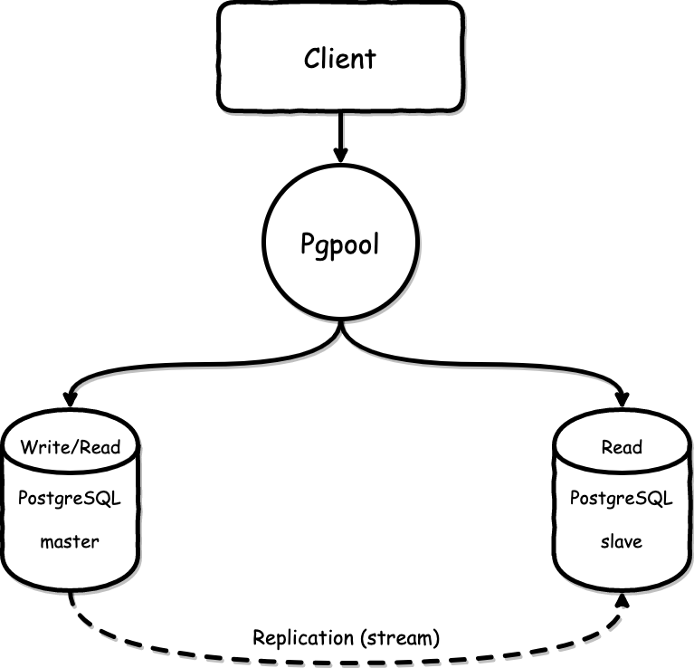

# PostgreSQL Server
## System Architecture

---

## Requirement

Hostname     | IP Address
-------------|--------------
pgpool-1     | 192.168.33.11
postgresql-1 | 192.168.33.21  
postgresql-2 | 192.168.33.22

---

## Install PostgreSQL in primary and standby server
#### Login root user
```
sudo su
```
#### Update repository for postgresql
```
sudo sh -c 'echo "deb http://apt.postgresql.org/pub/repos/apt/ $(lsb_release -cs)-pgdg main" > /etc/apt/sources.list.d/pgdg.list'
```
```
wget -q -O - https://www.postgresql.org/media/keys/ACCC4CF8.asc | sudo apt-key add -
```

#### Update repository for repmgr
```
sudo sh -c 'echo "deb https://apt.2ndquadrant.com/ $(lsb_release -cs)-2ndquadrant main" > /etc/apt/sources.list.d/2ndquadrant.list'
```
```
curl https://apt.2ndquadrant.com/site/keys/9904CD4BD6BAF0C3.asc | sudo apt-key add -
```

#### Update packages
```
sudo apt-get update
sudo apt-get upgrade -y
```

#### Install PostgreSQL and Repmgr
```
sudo apt-get install -y postgresql-12 postgresql-12-repmgr
```

#### generate ssh-key all servers
```
ssh-keygen

# Paste ssh key id_rsa.pub on other servers
nano .ssh/authorized_keys
```

---
## Configure in primary and standby server
#### Create user for replication in database (named repmgr)
```
sudo -i -u postgres
createuser --replication --createdb --createrole --superuser repmgr
createdb --owner=repmgr repmgr
psql -c "ALTER USER repmgr SET search_path TO repmgr, public;"
exit
```

#### Change config in primary and standby server
```
sudo nano /etc/postgresql/12/main/postgresql.conf
```
```
listen_addresses = '*'
wal_level = hot_standby # send data without delay
archive_mode = on
archive_command = 'test ! -f /mnt/postgresql-server/archive/%f && cp %p /mnt/postgresql-server/archive/%f'
max_replication_slots = 10 # set maximal number of replication slots
max_wal_senders = 10 # maximal number of concurrent connections from standby servers
wal_keep_segments = 64
hot_standby = on
synchronous_standby_names = '*'
shared_preload_libraries = 'repmgr'
```
or use shell scripts
```
sudo sed -i -e "s/#listen_addresses = 'localhost'/listen_addresses = '*'/g" /etc/postgresql/12/main/postgresql.conf
sudo sed -i -e "s/#wal_level = replica/wal_level = hot_standby/g" /etc/postgresql/12/main/postgresql.conf
sudo sed -i -e "s/#archive_mode = off/archive_mode = on/g" /etc/postgresql/12/main/postgresql.conf
sudo sed -i -e "s/#archive_command = ''/archive_command = 'test ! -f /mnt/postgresql-server/archive/%f && cp %p /mnt/postgresql-server/archive/%f'/g" /etc/postgresql/12/main/postgresql.conf
sudo sed -i -e "s/#max_wal_senders = 10/max_wal_senders = 10/g" /etc/postgresql/12/main/postgresql.conf
sudo sed -i -e "s/#max_replication_slots = 10/max_replication_slots = 10/g" /etc/postgresql/12/main/postgresql.conf
sudo sed -i -e "s/#wal_keep_segments = 0/wal_keep_segments = 64/g" /etc/postgresql/12/main/postgresql.conf
sudo sed -i -e "s/#hot_standby = on/hot_standby = on/g" /etc/postgresql/12/main/postgresql.conf
sudo sed -i -e "s/#synchronous_standby_names = ''/synchronous_standby_names = '*'/g" /etc/postgresql/12/main/postgresql.conf
sudo sed -i -e "s/#shared_preload_libraries = ''/shared_preload_libraries = 'repmgr'/g" /etc/postgresql/12/main/postgresql.conf
```
```
sudo mkdir -p /mnt/postgresql-server/archive
```

#### Add/change postgresql connectivity in primary and standby server
```
sudo nano /etc/postgresql/12/main/pg_hba.conf
```
```
host    repmgr          repmgr          192.168.33.21/32        trust
host    repmgr          repmgr          192.168.33.22/32        trust

host    replication     repmgr          192.168.33.22/32        trust
host    replication     repmgr          192.168.33.22/32        trust
```

#### Restart service postgresql
```
sudo service postgresql restart
```

#### Testing repmgr
```
sudo -i -u postgres
psql 'host=192.168.33.21 dbname=repmgr user=repmgr connect_timeout=2'
```

---
## Create configure repmgr in primary and standby server
#### For primary server
```
sudo nano /etc/repmgr.conf
```
```
node_id=1
node_name='node1'
conninfo='host=192.168.33.21 user=repmgr dbname=repmgr connect_timeout=2'
data_directory='/var/lib/postgresql/12/main'
reconnect_attempts=4
reconnect_interval=5
failover='automatic'
pg_bindir='/usr/lib/postgresql/12/bin'
promote_command='repmgr standby remote -f /etc/repmgr.conf'
follow_command='repmgr standby follow -f /etc/repmgr.conf'
log_level=INFO
log_file='/var/loh/postgresql/repmgr.log'
failover='automatic'
```

#### For standby server
```
sudo nano /etc/repmgr.conf
```
```
node_id=2
node_name='node2'
conninfo='host=192.168.33.22 user=repmgr dbname=repmgr connect_timeout=2'
data_directory='/var/lib/postgresql/12/main'
reconnect_attempts=4
reconnect_interval=5
failover='automatic'
pg_bindir='/usr/lib/postgresql/12/bin'
promote_command='repmgr standby remote -f /etc/repmgr.conf'
follow_command='repmgr standby follow -f /etc/repmgr.conf'
priority=80
log_level=INFO
log_file='/var/loh/postgresql/repmgr.log'
```

#### Allow automatic failover in primary and standby server
```
sudo nano /etc/default/repmgrd
```
```
REPMGRD_ENABLED=yes
REPMGRD_CONF="/etc/repmgr.conf"
```

#### Restart repmgr service
```
sudo service repmgrd restart
```

### Register cluster in primary server
```
sudo -i -u postgres
repmgr primary register
repmgr cluster show
```

### Register cluster in standby server
```
sudo service postgresql stop
sudo service repmgrd stop
```
```
sudo rm -rf /var/lib/postgresql/12/main
sudo -i -u postgres
repmgr -h 192.168.33.21 -U repmgr -d repmgr -f /etc/repmgr.conf standby clone
exit
sudo service postgresql start
```
```
sudo -i -u postgres
repmgr -f /etc/repmgr.conf standby register
repmgr cluster show
```

#### If you can't use psql in standby server
```
chown -R postgres:postgres /var/lib/postgresql/12/
chmod -R u=rwX,go= /var/lib/postgresql/12/
service postgresql restart
```

---
## Checking replication status
#### You should have one Slave in sync_state = sync and all others in sync_state = potential
```
psql -U repmgr -h 192.168.33.21 -p 5432 -x -c "select * from pg_stat_replication"
```

#### All the slaves should return on, the master returns off, since it can also execute write queries
```
psql -U repmgr -h 192.168.33.21 -p 5432 -x -c "show transaction_read_only"
```

---
## PgPool2 server
#### Login root user
```
sudo su
```
#### Update repository
```
sh -c 'echo "deb http://apt.postgresql.org/pub/repos/apt/ $(lsb_release -cs)-pgdg main" > /etc/apt/sources.list.d/pgdg.list'
```
```
wget -q -O - https://www.postgresql.org/media/keys/ACCC4CF8.asc | sudo apt-key add -
```

#### Update packages
```
apt-get update
apt-get upgrade -y
```

#### Install packages
```
apt-get install -y postgresql-client-12 pgpool2
```

#### Update config pgpool
```
nano /etc/pgpool2/pgpool.conf
```
```
listen_addresses = '*'   
port = 5432

backend_hostname0 = '192.168.33.21'
backend_port0 = 5432
backend_weight0 = 1
backend_data_directory0 = '/var/lib/postgresql/12/main'
backend_flag1 = 'ALLOW_TO_FAILOVER'
          
backend_hostname1 = '192.168.33.22'
backend_port1 = 5432
backend_weight1 = 1
backend_data_directory1 = '/var/lib/postgresql/12/main'
backend_flag1 = 'ALLOW_TO_FAILOVER'

load_balance_mode = on
master_slave_mode = on
master_slave_sub_mode = 'stream'
sr_check_user = 'pgpool'
sr_check_database = 'pgpool'
wd_lifecheck_user = 'pgpool'

health_check_period = 30
health_check_timeout = 20
health_check_user = 'pgpool'
health_check_password = ''
health_check_database = 'pgpool'
health_check_max_retries = 5
health_check_retry_delay = 20
connect_timeout = 10000
```

#### Create pgpool user on primary server
```
create user pgpool;
create database pgpool;
GRANT ALL PRIVILEGES ON DATABASE "pgpool" to pgpool;
```

#### Create admin user for testing
```
CREATE ROLE admin WITH NOSUPERUSER CREATEDB PASSWORD '12345678' LOGIN;
```

#### Update pool_hba.conf
```
nano /etc/pgpool2/pool_hba.conf
```
```
host    repmgr          repmgr          192.168.33.21/32        trust
host    repmgr          repmgr          192.168.33.22/32        trust
host    replication     repmgr          192.168.33.22/32        trust
host    replication     repmgr          192.168.33.22/32        trust
host    pgpool          pgpool          192.168.33.11/32        trust
host    all             all             192.168.33.11/32        md5
```

#### Add postgresql connectivity in primary and standby server
```
nano /etc/postgresql/12/main/pg_hba.conf
```
```
host    pgpool          pgpool          192.168.33.11/32        trust
host    all             all             192.168.33.11/32        md5
```

#### Restart service postgresql in primary and standby server
```
service postgresql restart
```

#### Restart repmgr service in pgpool server
```
service pgpool2 restart
```

#### Assign password postgres into pg_password
```
pg_md5 -u admin -m 12345678
```

#### Stop and Start Pgpool
```
pgpool stop
```
```
pgpool -n
pgpool  
```

#### Testing PgPool
```
createdb -h 192.168.33.11 db-admin -U admin
psql -h 192.168.33.11 db-admin -U admin
```
---
```
Success. You can now start the database server using:

    pg_ctlcluster 12 main start

Ver Cluster Port Status Owner    Data directory              Log file
12  main    5432 down   postgres /var/lib/postgresql/12/main /var/log/postgresql/postgresql-12-main.log
```